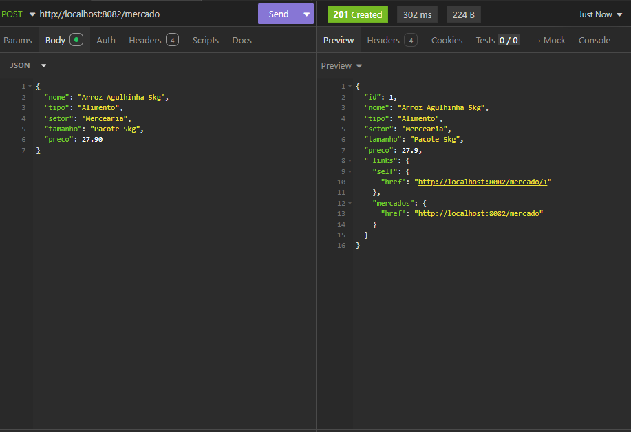
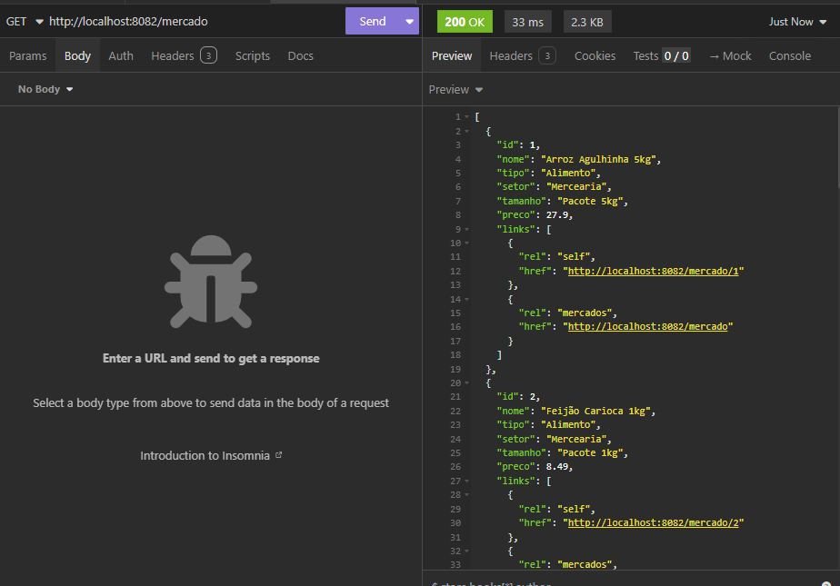
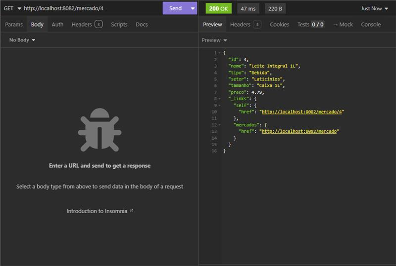

# 🛒 Mercado Express - Spring Boot - CP04

## 📌 Descrição do Projeto
Aplicativo desenvolvido em **Java com Spring Boot (Maven)** para um sistema do tipo mercado express.

O sistema implementa as operações básicas de **CRUD (Create, Read, Update e Delete)** utilizando:
- Banco de dados **Oracle SQL Developer**
- Dependência **Lombok**
- Padrão de retorno **HATEOAS (nível 3)**
- Testes de endpoints via **Postman**

---

## 🛠️ Tecnologias Utilizadas
- Java  
- Spring Boot  
- Maven  
- Lombok  
- Oracle SQL Developer  
- Postman

---

## ⚙️ Configuração do Projeto
- **IDE utilizada**: IntelliJ 
- Porta utilizada: **8082**  
- Banco: **ORACLE_FIAP**  
- Tabela utilizada: **TDS_TB_MERCADO**

**Colunas da tabela:**  
- Id  
- Nome  
- Tipo  
- Setor  
- Tamanho  
- Preço  

---

## 🚀 Endpoints CRUD

### 🔹 Create (POST)
- **Endpoint:** `/mercado`  
- **Exemplo JSON:**
```json
{
  "nome": "Arroz Agulhinha 5kg",
  "tipo": "Alimento",
  "setor": "Mercearia",
  "tamanho": "Pacote 5kg",
  "preco": 27.90
}
```


### 🔹 Read (GET)
- **Endpoint:** `/mercado`  


## Get por ID
- **Endpoint:** `/mercado/{id}`  



### 🔹 Update (PUT)
- **Endpoint:** `/mercado/{id}`  
- **Exemplo JSON:**
```json
{
  "nome": "Arroz Agulhinha 5kg",
  "tipo": "Alimento",
  "setor": "Mercearia",
  "tamanho": "Pacote 5kg",
  "preco": 27.90
}
```

### 🔹 Delete (DELETE)
- **Endpoint:** `/mercado/{id}`  
- **Exemplo JSON:**

